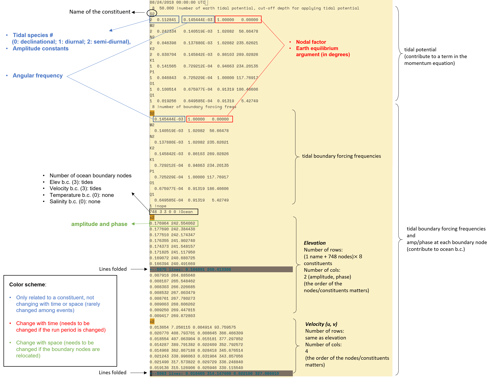

# Overview
The input file "bctides.in" specifies the types of open boundary conditions at each open boundary.

It also specifies the variable values along spatially and temporally uniform open boundaries (e.g., constant water level);
in the case of more complex (e.g., 3D spatially and temporally varying) open boundaires, additional files are needed to specify variable values (see SCHISM manual).

Under the 2D compound flooding setup, bctides.in specifies 8 tidal constituents for elevation and velocity at a single open (ocean) boundary with a format similar to ADCIRC's fort.15.
The figure below serves as a quick reference of the structure of bctides.in.
[](bctides.png)
The 3D setup additionally specifies 3D temporally and spatially varying temperature and salinity values along the ocean boundary.

# Scripts
A Python script is provide under the [pylib](https://github.com/wzhengui/pylibs) library prepared by Dr. Zhengui Wang:
```bash
pylibs//Scripts/gen_bctides.py

```
The usage is self-evident; you only need to read the "input" section at the beginning of the script.

Alternatively, if you have an existing bctide.in and only need to change the simulation period (temporally varying part),
you can use this script in SCHISM GIT:
```bash
[schism_git_dir]/schism/src/Utility/Tides/tide_fac_improved/tide_fac_improved
```

For a complete reference on "bctides.in", see the SCHISM manual and the sample under your SCHISM GIT directory:
```bash
[schism_git_dir]/schism/sample_inputs/bctides.in
```
