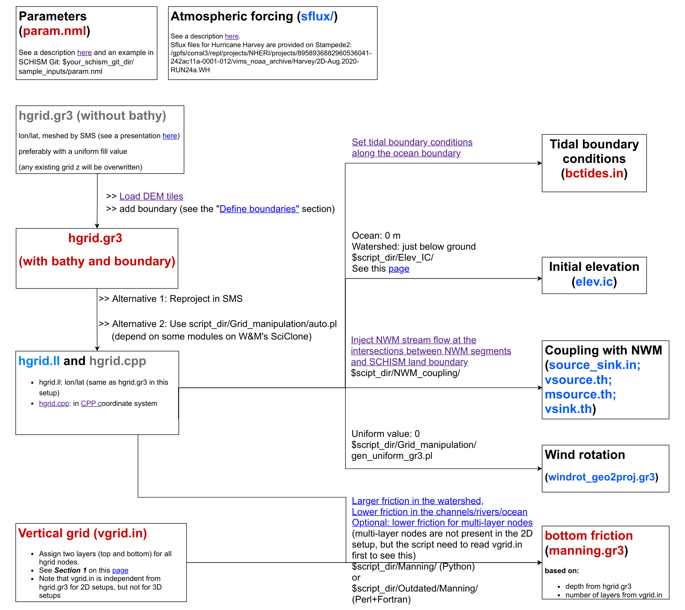

# Overview
{: .no_toc }

Some overview

# Workflows
{: .no_toc }

Several different setups are provided here.
Select the one you need and follow its workflow to setup the model.
Click on the workflow to open it in another tab, where a link to each input is provided along with the workflow.

## 2D ECGC (East Coast and Gulf Coast) setup
{:target="_blank"}

---

## 3D ECGC (East Coast and Gulf Coast) setup

---

Alternatively, you can peruse all relavant inputs.

