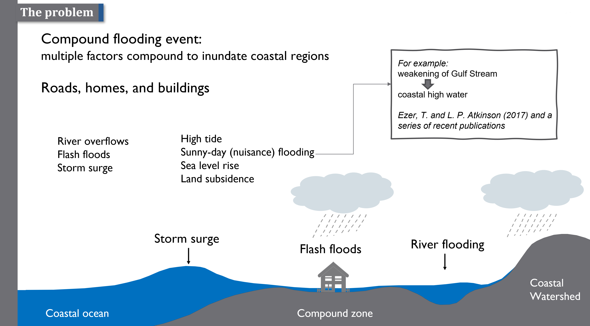

# Compound Flooding Models Overview
{: .no_toc }

SCHISM has the capability to simulate "compound flooding," which occurs when multiple flood factors, such as storm surge, river discharge, and rainfall, combine during a wet storm event. This is a challenging problem as it involves integrating watershed areas above sea level into an ocean model, requiring careful coordination between land-based and oceanic processes.

This innovative technique has been successfully implemented in the 3D component of NOAA's Surge and Tide Operational Forecast System ([STOFS-3D-Atlantic](https://polar.ncep.noaa.gov/estofs/)).

---

# Workflows for Compound Flooding Simulations
{: .no_toc }

The workflows for setting up compound flooding simulations vary depending on whether a 2D or 3D model configuration is used. Below, we outline these workflows and provide resources to help you get started.

## 2D ECGC (East Coast and Gulf Coast) Setup

The following diagram illustrates the workflow for the 2D version of the East Coast and Gulf Coast (ECGC) setup. This setup simplifies the problem by focusing on two-dimensional processes.

{:target="_blank"}

*Note: Please disregard the links within the diagram, as they refer to outdated scripts.*

---

## 3D ECGC (East Coast and Gulf Coast) Setup

The 3D ECGC setup builds upon the 2D configuration by adding vertical layers to capture three-dimensional processes. The workflow for this setup will be detailed here soon. Stay tuned for updates!

---

## Automated Workflow Scripts

The entire workflow is automated, ensuring efficient and consistent setups for compound flooding simulations. The scripts used in these workflows are regularly updated and maintained in the SCHISM GitHub repository. 

You can find the relevant scripts in this [folder](https://github.com/schism-dev/schism/tree/master/src/Utility/Pre-Processing/STOFS-3D-Atl-shadow-VIMS/Pre_processing). To get started, take a look at the [driver script](https://github.com/schism-dev/schism/blob/master/src/Utility/Pre-Processing/STOFS-3D-Atl-shadow-VIMS/Pre_processing/stofs3d_atl_driver.py), which guides the entire preprocessing workflow.

---

By following these workflows and using the automated scripts, you can efficiently set up simulations for compound flooding scenarios. If you encounter any challenges, feel free to explore the GitHub repository or contact the SCHISM team for further assistance.
