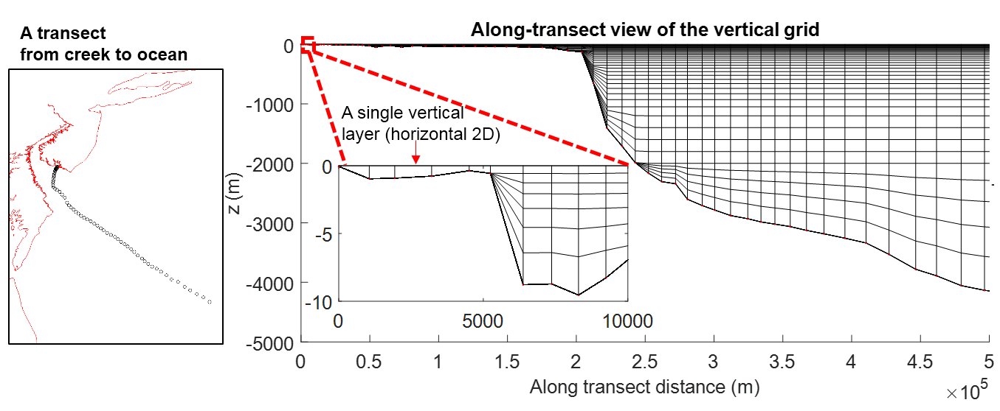
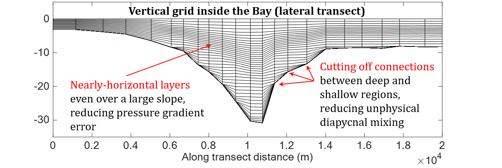
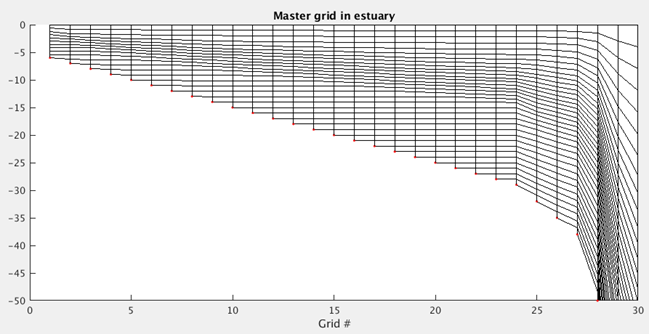
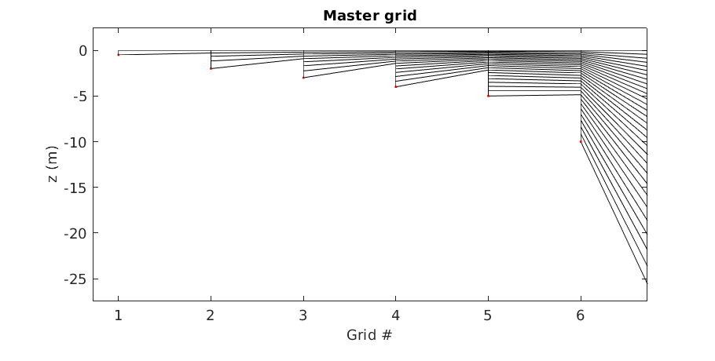

# Overview
The LSC<sup>2</sup> coordinate system ([reference](https://www.sciencedirect.com/science/article/pii/S1463500314001437)) is used for the 3D ECGC setup.
It specifies 1–43 grid layers, with 43 layers being applied in the deep ocean and 1 layer in most of the watershed (see figure below), thus effectively rendering the model 2DH there, which is sufficient for processes like overland flow and inundation.
See SCHISM manual for a complete reference on generating different types of vertical grids.

# Scripts
A Fortran script is provided in Git to generate the vgrid.in in LSC<sup>2</sup>:
```bash
[schism_git_dir]/src/Utility/Pre-Processing/NWM/Vgrid/gen_vqs.f90
```
A sample compile command is (assuming intel Fortran compiler is used):
```bash
ifort -Bstatic -O2 -CB -o gen_vqs gen_vqs.f90 schism_geometry.f90
```

To generate vgrid.in with existing hgrid.\*, you can do the following on the command line:
```bash
cp -rL [schism_git_dir]/src/Utility/Pre-Processing/NWM/Vgrid/ [your_run_dir]
```
For visualization, you need to specify the spatial locations of the sample points of interest in 
```bash
[your_run_dir]/Vgrid/transect.bp
```
A sample "transect.bp" should already be there. Then, do
```bash
./auto.pl
```

The vertical grid can be visualized by a Matlab script
```bash
[your_run_dir]/Vgrid/plot_VQS.m
```
A typical vertical grid along a creek-ocean transect looks like this:


Note the following features of the vertical grid:
- Terran-following and variable layer numbers based on depth
- A single layer (horizontally 2D representation) in shallow areas
- Nearly horizontal layers in the ocean

# Grid quality
LSC2 is essentially an unstructured gridding system in the vertical dimension, which provides infinite degree of freedom.
The grid quality criterion is still an active research topic, which depends largely on the patterns/processes to be resolved.
In the above example, a single layer is desired in the watershed above MSL in the Delaware Bay to stabilize the simulation of pluvial processes.
In another study on the Chesapeake Bay, the mid-depth layers are refined to better capture the pycnocline:


In either case, we don't have a quantatative measure on the grid quality; but a basic rule is to avoid the so-called "backward stairs" in the "master grid" (which is also generated by plot_VQS.m).
A good master grid (the one from the Chesapeake Bay example) looks like:

A bad master grid with "backward stairs" looks like:


The master grid serves as a reference table for the vertical discretization on different depths (see details in the SCHISM manual). Users interested in quantative measures on vertical grid quality are encouraged to contact [Dr. Eli Ateljevic](Eli.Ateljevich@water.ca.gov) from the California Department of Water Resources.
